# 图解HTTP
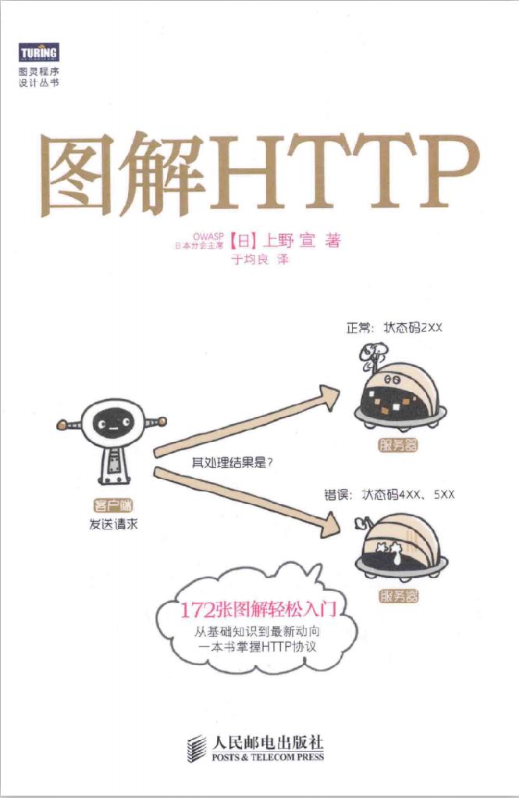
## 第1章 了解Web及网络基础
TCP/IP协议族最重要的一点就是**分层**
### 1.TCP/IP协议分层
应用层、传输层、网络层和数据链路层

谢希仁的版本加个**物理层**

### 2.IP不是IP地址
IP是协议

IP地址指明身份

IP间的通信依赖 MAC 地址

### 3.TCP协议
握手使用 TCP 标志(Flag)——SYN(synchronize,同步)和ACK(acknowledgement,确认)

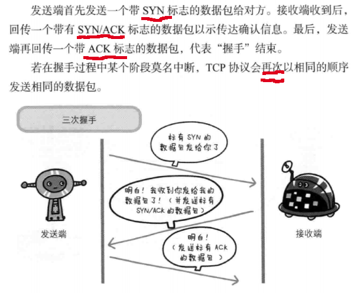

### 4.RFC(Request for Commentes,征求修正意见书)
并不是所有的应用程序都符合 RFC ，但不按照RFC的话，可能无法访问

## 第2章 简单的HTTP协议
### 1.客户端与服务器
**客户端**:请求资源

**服务器**:提供资源

### 2.HTTP实例
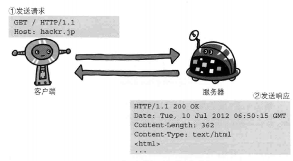
```
客户端：发送请求
GET /index.html HTTP/1.1      #GET方法(method)表示请求访问，  /index.html 表示请求对象， HTTP/1.1 表示HTTP的版本号
Host:hackr.jp
```

```
服务器：发送响应
HTTP/1.1 200 OK     #HTTP/1.1服务器对应的HTTP版本， 200 OK 请求处理的状态码(status code)
Data: TUE, 10 Jul 2012 06:50:15 GMT
Content-Length:362
Content-Type:text/html
<html>
...
```

### 3.HTTP不保存状态
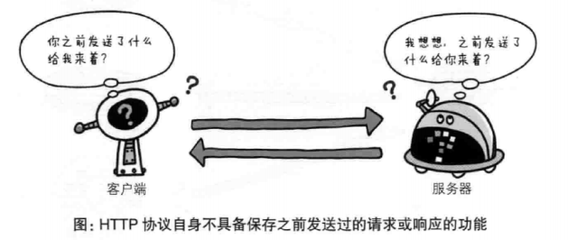

可是，当淘宝登入用户不能没跳转一个界面就要重新登入一次，网站为了能掌握是谁发出的请求，引入**Cookie技术**

### 4.告知服务器自己意图的 HTTP 方法
方法名区分大小写，注意用大写字母
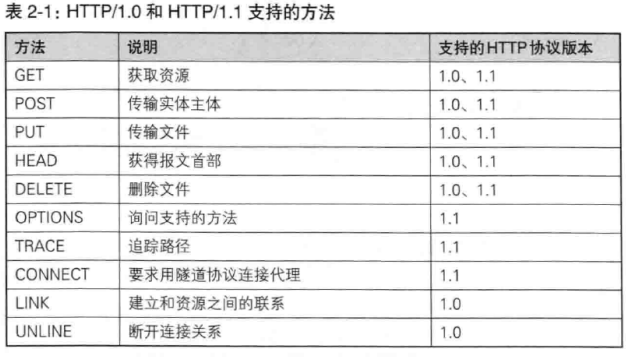

#### 1)GET获取资源
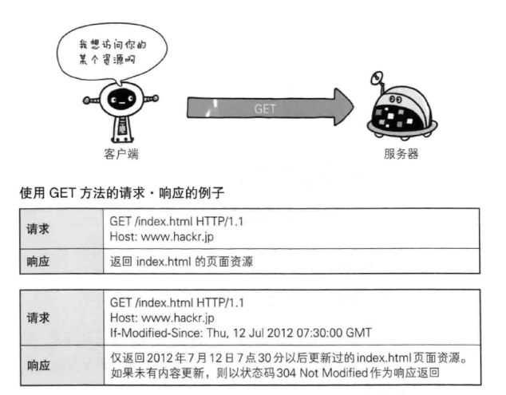

使用 GET 方法，如果请求的是文本，那就保持原样返回；如果是 CGI(Common Gateway Interface,通用 网管接口)，则返回执行的结果。

#### 2)POST传输实体主体
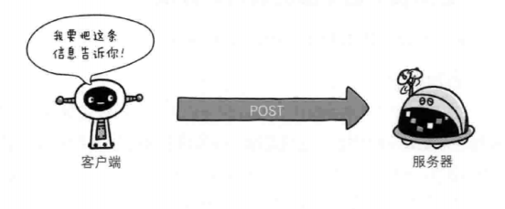

#### 3)PUT传输文件
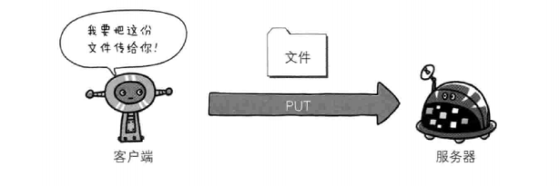

一般网站不开放这个权限

#### 4)HEAD获取报文首部
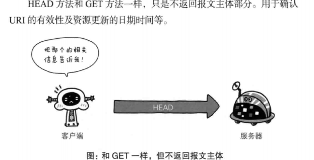

#### 5)DELETE删除文件
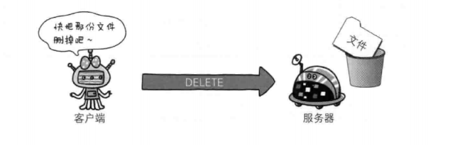

一般网站不开放这个权限


#### 6)OPTIONS询问支持的方法
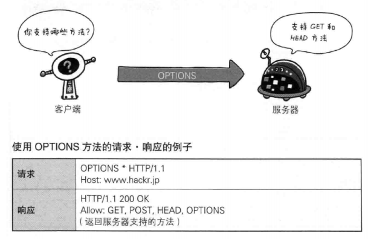

#### 7)TRACE追踪路径
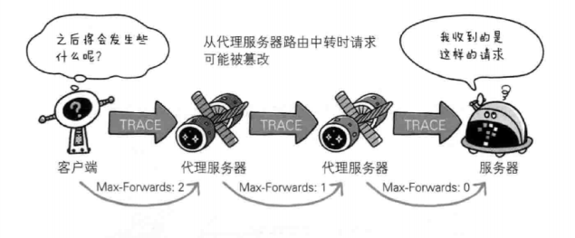

#### 8)CONNECT要求用隧道协议连接代理
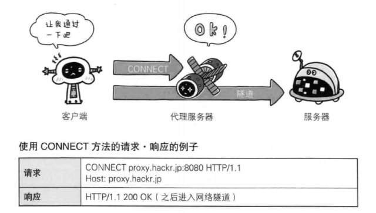

CONNECT 方法要求与代理服务器建立隧道， 实现用隧道协议进行 TCP 通信，主要使用 SSL(Secure Sockets Layer, 安全套接层)和TLS(Transport Layer Security，传输层安全)协议，把通信内容加密后经网络隧道传输。

```
格式：
CONNECT 代理服务器名:端口号 HTTP版本 
```
### 5.曾经的HTTP
HTTP 1.0 通信一次就断开一次

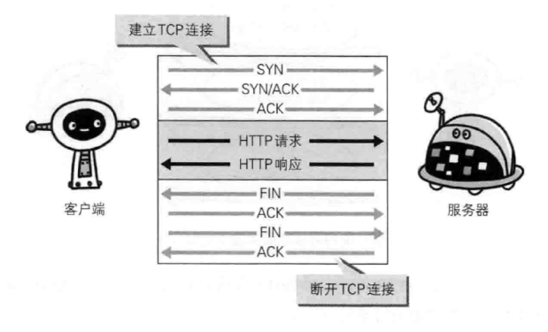

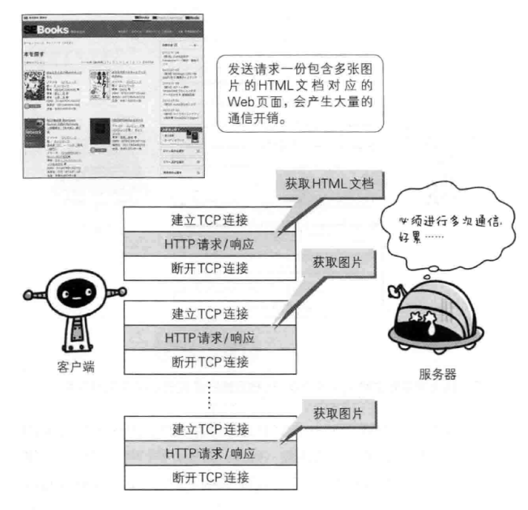

但是 HTTP/1.1 和 部分 HTTP/1.0 提出 **持久连接(HTTP Persistent Connections, 也叫 HTTP keep-alive 或 HTTP connection reuse)**

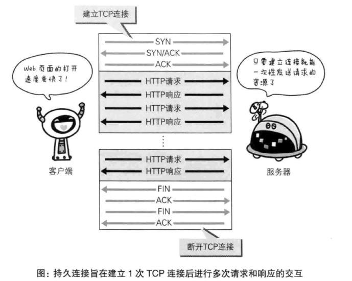

### 6.使用 Cookie 状态管理
**Set-Cookie** 首部字段信息通知客户端保存 Cookie ，当下次客户端在想服务器发送请求的时候，会自动加上 Cookie 值在发送出去。

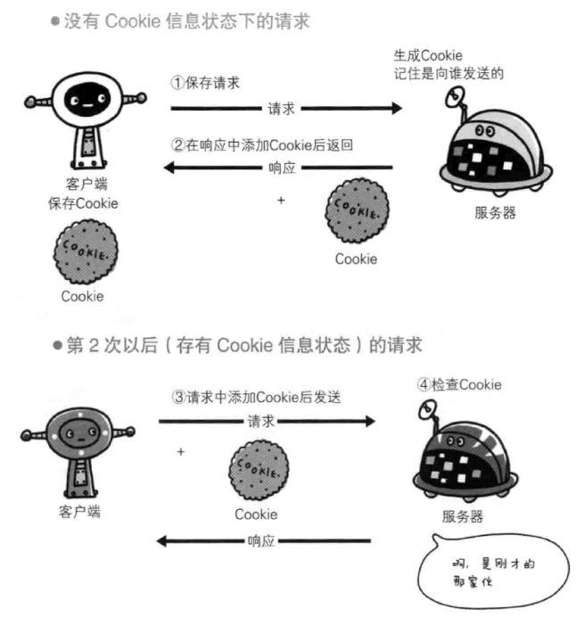
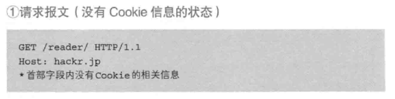
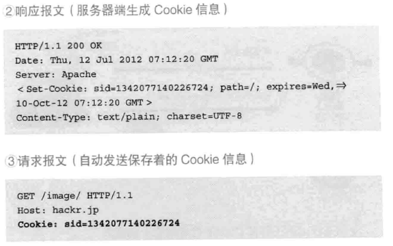

## 第3章 HTTP报文内的HTTP信息
### 1.请求报文与响应报文结构
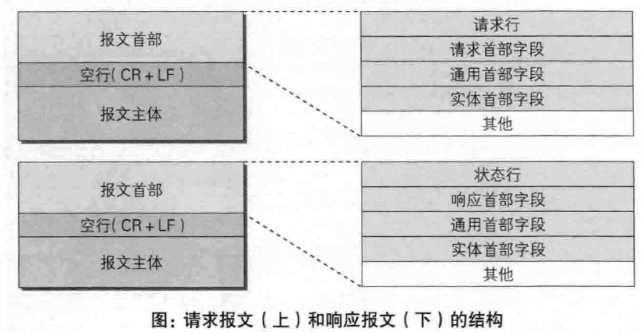
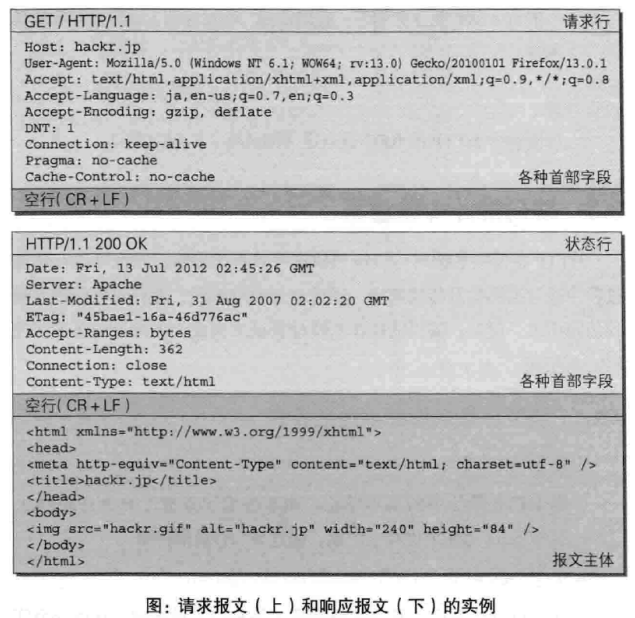

### 2.报文主体与实体主体的差异
#### 1)报文(message)
是HTTP通信的基本单位，由8位组字节流(octet sequence)组成，通过 HTTP 通信传输。

#### 2)实体(entity)
作为请求或响应的 **有效补充的数据** 被传输，是由 实体首部和树体主体 组成。

### 3.发送多种数据的多部分对象集合
比如：发送邮件的时候，可以添加文字，图片，视频，这是因为采用了 **MIME(Multipurpose Internet Mail Extensions，多用途因特网邮件扩展)** 机制，它允许邮件处理不同类型的数据。

### 4.内容协商返回最合适的内容
比如浏览器默认是英文或中文，访问时会显示响应的版本这样的机制叫 **内容协商(Content Negotiation)**

内容协商：客户端和服务器就响应的内容进行交涉，提供最合适的资源。

## 第4章 返回结果的HTTP状态码
### 1.状态码告知服务器端返回的请求结果
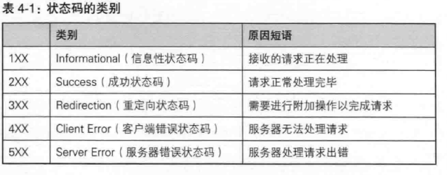

### 2.2XX 成功
#### 1)200 OK
#### 2)204 No Content
不允许返回任何实体的主体

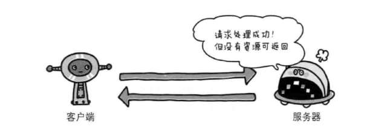

#### 2)206 Partial Content
范围请求

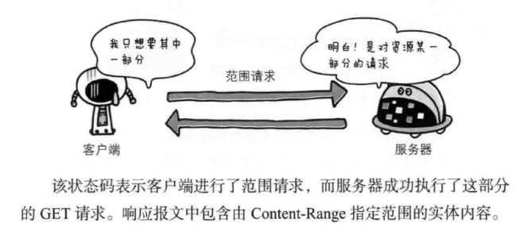

### 3.3XX 重定向
#### 1)301 Moved Permanently

#### 2)302 Found

#### 3)303 See Other

#### 4)304 Not Modified
304虽然被划分到 3XX 但是和重定向没有什么关系

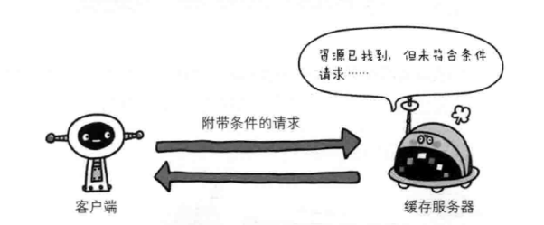

### 4.4XX
#### 1)400 Bad Request
#### 2)401 Unauthorized
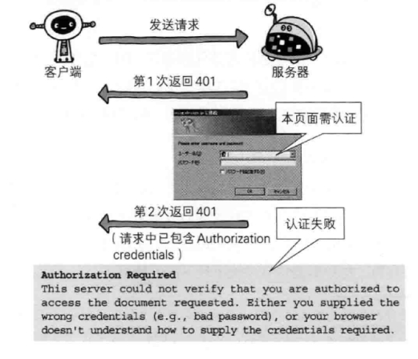

该状态码表示发送请求需要通过 **HTTP认证(BASIC认证、DIGEST认证)** 的认证身份。

浏览器第一次接收 401 响应会弹出认证的对话窗口

#### 3)403 Forbidden

#### 4)404 Not Found

### 5.5XX
#### 1)500 Internal Server Error

#### 2)503 Service Unavailable

### 6.状态码和状况不一致
返回的状态码可能不一定反应真是情况，有时Web服务错误，但是依旧是 200 OK

## 第5章 与HTTP协作的Web服务器
### 1.通信数据转发——代理、网关、隧道
HTTP通信时，出客户端和服务器以外，还需要一些用于通信数据转发的应用程序——代理、网关、隧道，他们配合服务器工作。

#### 1)代理
中间人

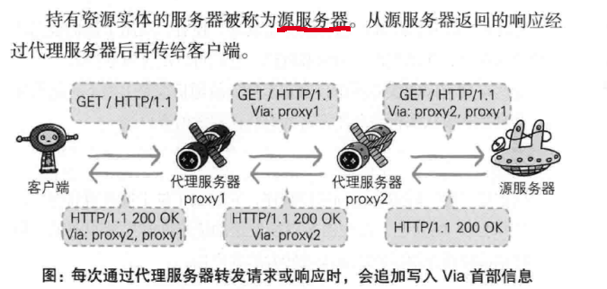

##### (1)优点
**缓存技术**减少网络带宽的流量、组织内部针对特定网站的访问控制、获取访问日志

##### (2)缓存代理
复制一份到代理服务器，直接回复客户端请求

##### (3)透明代理(Transparent Proxy)
不对报文做任何加工


#### 2)网关
转发其他服务器通信数据的**服务器**,接收客户端发来的请求，就像自己拥有资源一样想用客户端，客户端可能察觉不出来

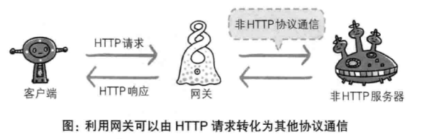

##### (1)优点
网关与代理十分相似，但网关可以提供非HTTP协议服务

#### 3)隧道
负责中转的**程序**

### 2.缓存技术
#### 1)缓存是有期限的

#### 2)缓存可以有缓存服务器和客户端缓存

### 3.HTTP之前的协议
#### 1)FTP(File Transfer Protocol)
比TCP/IP协议族还要早

#### 2)NNTP(Network News Transfer Protocol)

#### 3)Archie

#### 4)WAIS(Wide Area Information Servers)

#### 5)Gopher

## 第6章 HTTP首部
### 1.HTTP报文结构
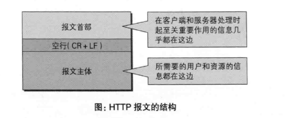

### 2.HTTP/1.1首部字段(47个)
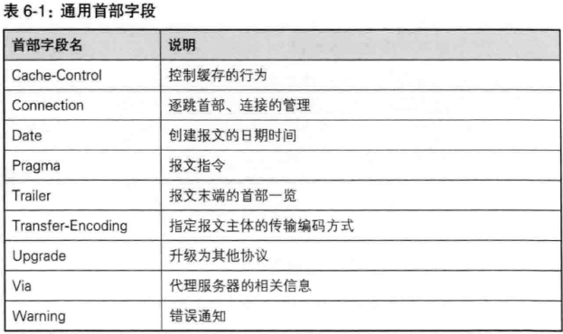

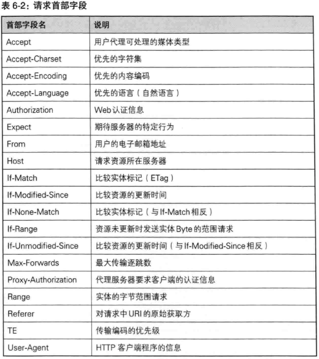

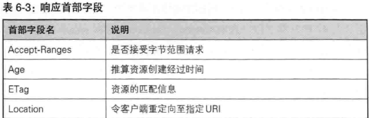
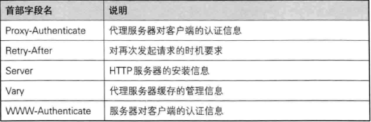

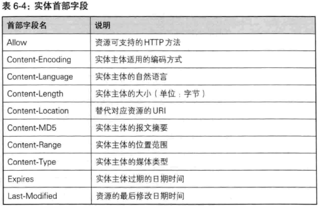

### 3.非HTTP/1.1首部字段
除去上面 47 个以外，还有 Cookie、Set-Cookie 和 Content-Disposition等

## 第7章 确保安全的HTTPS
### 1.HTTP缺点
- 通信使用明文

- 不验证通信双方身份，可能伪装

- 无法保证报文完整性，可能被篡改

### 2.通信的加密
HTTP协议没有加密机制，但是可以通过 SSL(Secure Socket Layer,安全套接层) 和 TLS(Transport Layer Security，安全层传输协议) 组合使用，加密 HTTP 通信内容。

与 SSL 组合使用 HTTP 称为 **HTTPS(HTTP Secure，超文本传输安全协议)** 或 **HTTP over SSL**。

### 3.HTTP+加密+认证+完整性保护 = HTTPS
HTTPS 并非是应用层的一种新协议，而是　**身披SSL外壳的HTTP**

通常，HTTP直接和TCP通信，但使用 SSL 之后，先和SSL通信，SSL在和 TCP 通信。

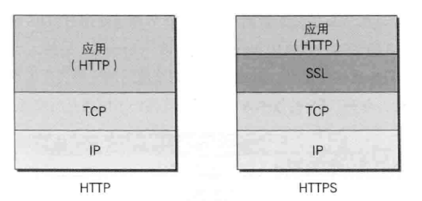

### 4.SSL是独立的
SSL是独立于 HTTP 的协议，其他运行在应用层的协议 Telnet、SMTP等协议，都可以配合SSL一起使用。

### 5.HTTPS通信
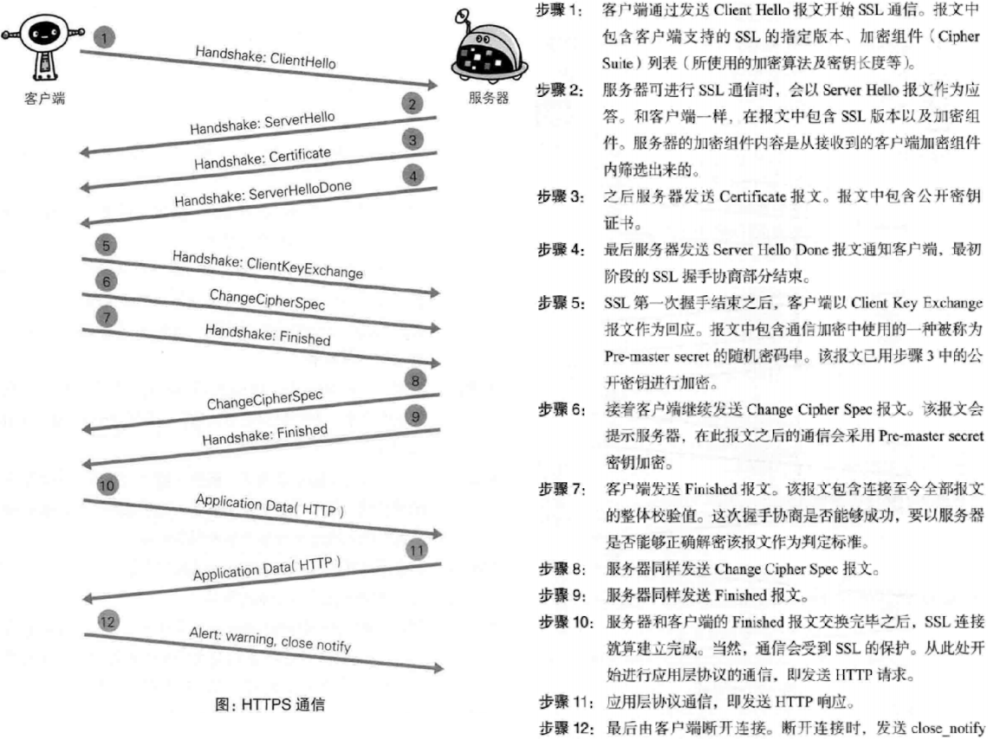


### 6.SSL 与 TLS
HTTPS 使用 SSL 与 TLS 两个协议。

TLS是以 SSL 为原型开发的协议，有时会统称 SSL，当前主流 SSL3.0和 TLS1.0

### 7.不是所有的通信都要HTTPS
SSL的处理速度会变慢。
一种是**通信速度慢** 另一种是**消耗大量CPU及内存资源**，而且服务器与客户端都要进行加密解密。

## 第8章 确认访问用户身份的认证
某些 Web 页面指向让特定人看见，或者仅本人可见

### 1.HTTP/1.1使用的认证方式
- BASIC认证(基本认证)

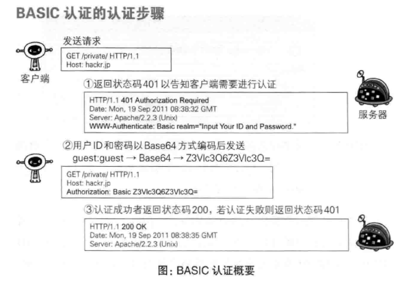

- DIGEST认证(摘要认证)

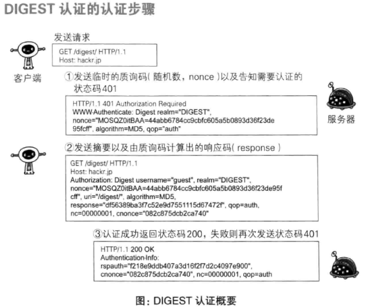

- SSL客户端认证

- FormBase认证(基于表单认证)
将客户端发送过来的ID和密码与之前登录过的信息做匹配来进行认证。

- Windows统一认证(Keberos认证, NTLM认证)

## 第9章 基于HTTP的功能追加协议
虽然HTTP简单，但是有些简陋，所以基于 HTTP 新增功能协议。
### 1.最初HTTP
最初建立 HTTP 主要用来传输 HTML。

但随着时代发展 Web 用途越来越多，SNS(Social Networking Service，社交网络服务)、在线购物等服务

### 2.取消HTTP 瓶颈的 SPDY
Google在2010发布SPDY
#### 1)HTTP的瓶颈
像很多 微信等SNS网站，实时都有几百万的数据，Web需要更新这些内容，在反馈到客户端的界面上，要想知道服务器有没有更新，就要频繁的通信确认。

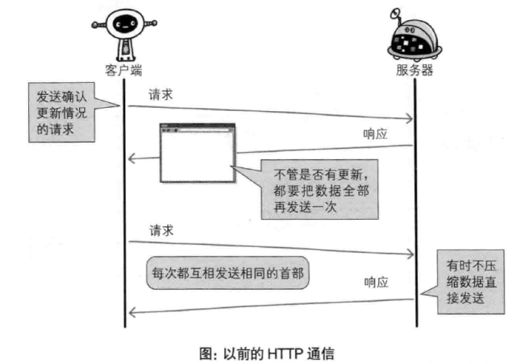


#### 2)Ajax 的解决方案
Ajax(Asynchronous JavaScript and XML，异步 JavaScript与 XML技术)是一种有效利用 JavaScript 和 DOM(Document Object Model，文档对象模型)的操作，这样可以达到 **局部Web页面替换**加载的一部通信方法。

Ajax的核心是 **XMLHttpRequest**的 API，通过 JavaScript脚本语言调用和服务器进行 HTTP 通信，局部更新。

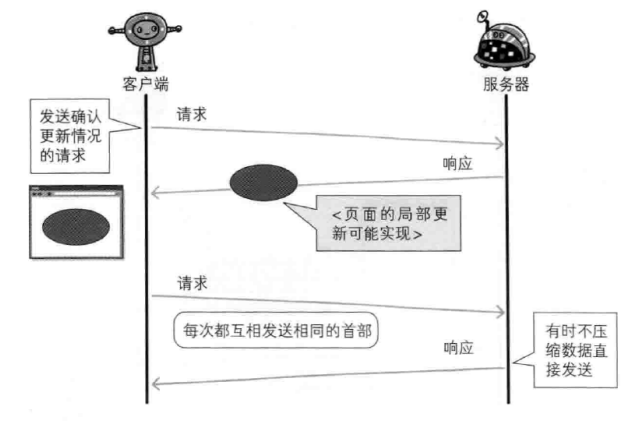

但是 Ajax 仍为解决HTTP协议本身的问题。

#### 3)Comet 的解决方法
一旦服务器有内容更新，Comet直接给客户端返回响应。但是，为了实现推送功能，Comet需要现将响应置于**挂起状态**，当服务器端有内容更新时，在返回响应。

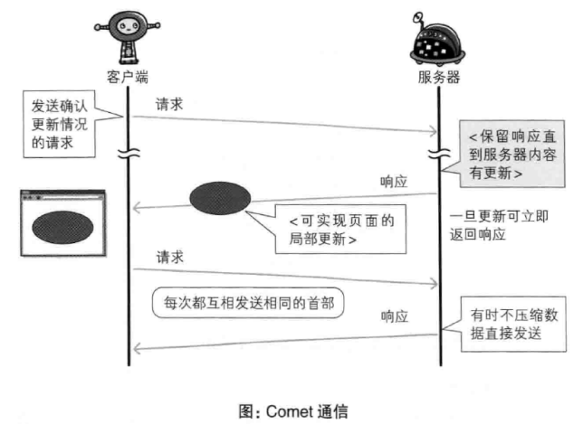

但是 Comet 仍为解决HTTP协议本身的问题。

#### 4)SPDY
Ajax 与 Comet 都没有解决 HTTP 协议本身的问题。

SPDY没有改写HTTP协议，再是在 TCP/IP 的应用层与运输层之间加 **新的会话层**，考虑到安全问题，SPDY使用SSL，

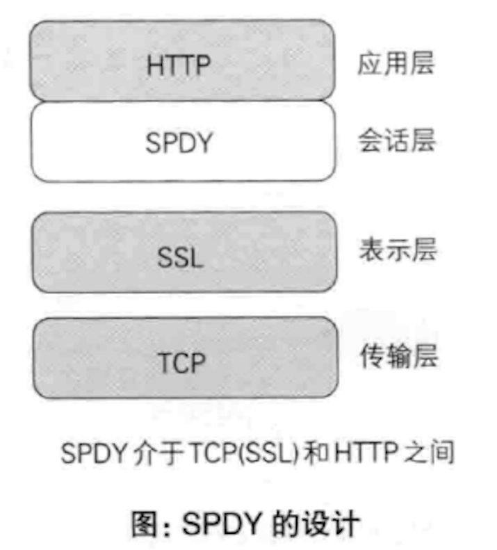

SPDY可以消除 HTTP 瓶颈， 但是 Web 本身不止 HTTP 一种协议，所以对 Web 本身速度提升还是不大。

### 3.使用 WebSocket 全双工通信
WebSocket，即 Web浏览器与 Web服务器 之间进行全双工通信标准，WebSocket的开发解决 Ajax 与 Comet 里的 XMLHttpRequest 附带的缺陷引起的问题。

#### 1)优点
在 HTTP 基础上建立的协议，**发起方**都是客户端。

但是在 WebSocket 基础上建立的协议，**发起方**客户端与服务器都可以直接想对方发送报文。

这样服务器就可以直接发起推送，而不需要等待客户端的请求，**只要**建立起 WebSocket 连接，就一直保持连接状态，而且首部信息比 HTTP 少，通信量减少。

#### 2)握手
实现 WebSocket，在 HTTP 连接建立之后，在完成一次握手。

##### (1)握手请求
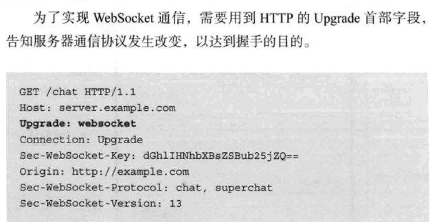

##### (2)握手响应
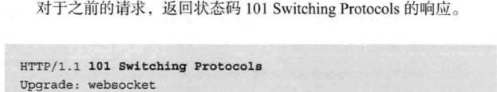


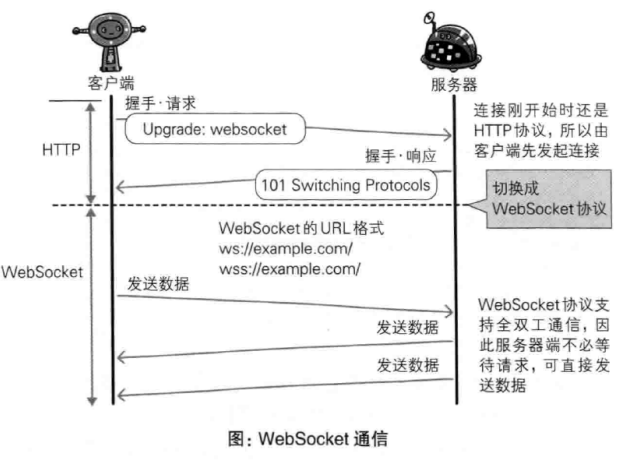

#### 3)WebSocket API
JavaScript调用[WebSocket API](https://www.w3.org/TR/websockets/)提供的 WebSocket 程序接口，实现全双工通信。

```javascript
//调用 WebSocket API， 每 50ms 发送一次数据
var socket = new WebSocket('ws://game.example.com:12010/updates');
socket.onopen = function(){
    setInterval(function(){
        if(socket.bufferedAmount == 0){
            socket.send(getUpdateData());
        }
    }, 50);
};
```
### 4.HTTP/2.0
改善 Web速度体验，提出

#### 1)WebDAV
WebDAV(Web-based Distributed Authoring and Versioning，基于万维网的分布式创作和版本控制)：对 Web 服务器上的内容直接进行文件复制、编辑等**分布式文件系统**

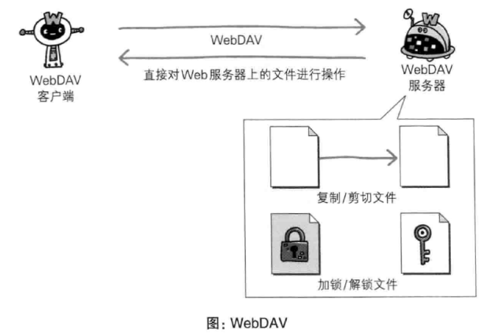

## 第10章 构建 Web 内容的技术
### 1.CGI
CGI是 Web 服务器在接收 客户端 发来的请求之后，转发给程序的**一组机制**

### 2.Servlet(Servlet = Server + Applet)
上面的 CGI 每次接到请求就要重启一次，一旦访问量比较大，Web服务器容易负载

但 Servlet 运行在与 Web 服务器**相同的进程**，受到的负载小，Servlet **运行环境**是**Web 容器或 Servlet 容器**。

## 第11章 Web的攻击技术


